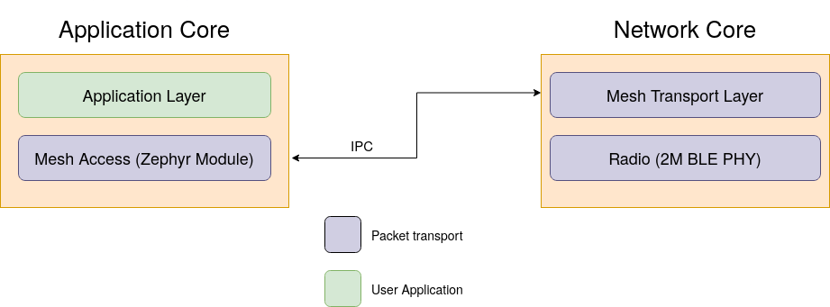
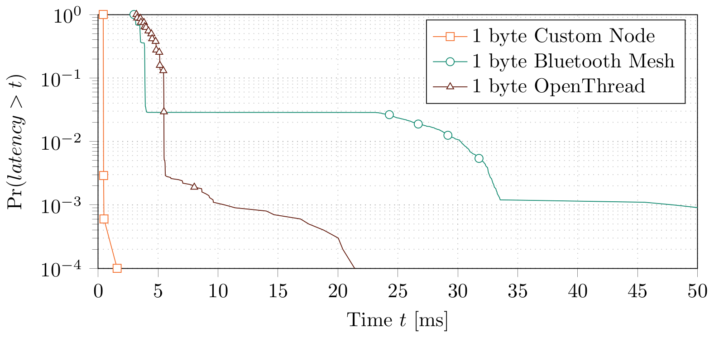

# Low latency packet transport for BLE Radio on the nRF5340

This project enables low-level control of the BLE radio on the Nordic Semiconductor [nRF5340](https://www.nordicsemi.com/Products/Low-power-short-range-wireless/nRF5340) to enable low latency message transport. 
More specifically, this project implements a packet transport layer running on the network core of the nRF5340, which is made accessible to applications running on the application core through a shared memory IPC interface; see the block diagram below. Packets consist of a 12 byte header and up to 243 bytes of payload.
By default, the packet transport layer uses the 2Mbit/s BLE physical layer.
The latency associated with sending a message generated at the application layer trough the packet transport layer and over the wireless channel to the application layer of the receiving node is less than 1 ms. 
The corresponding latency for Thread or Bluetooth Mesh is about 5 ms; see below.

In addition the packet transport layer provides mesh networking via a network flooding approach, i.e. packets received by a particular node that are addressed to another node are rebroadcasted. Packets are addressed based on a node-specific identifier. This process is transparent to the application. 
The packet transport layer does not provide reliable transport. Hence, applications must be tolerant of packet erasures and errors. 

The project is implemented as a [Zephyr RTOS](https://github.com/zephyrproject-rtos/zephyr) application.

## Latency measurements

Below, we show latency recorded for a 1 byte single-hop message. In particular, we show the CCDF, i.e., the probability of the latency exceeding a particular value. For reference, we also show latency recorded for Bluetooth Mesh and OpenThread. 
Latency for the custom node and for Bluetooth Mesh is recorded over a wired coaxial network, whereas for OpenThread latency is recorded over a wireless network. 
We expect that the minimum latency of OpenThread would be similar for a wired network, but that we would see different behaviour below about the `10^-2-th` percentile.
The latency achieved by this project is about an order of magnitude lower than that of Bluetooth Mesh and OpenThread.

